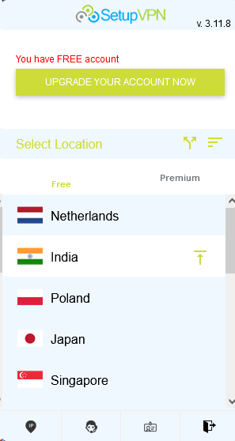
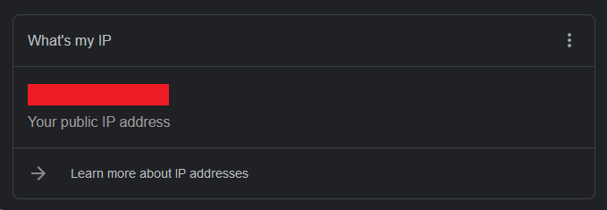
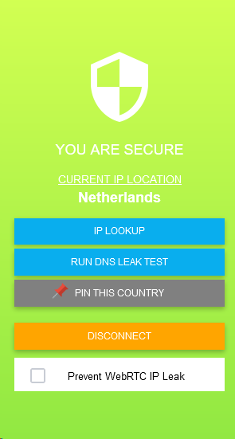
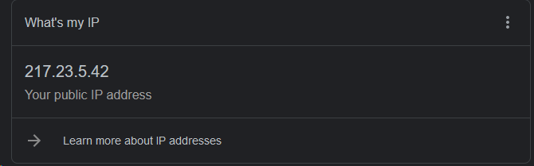

# Atestare la ASRC

A elaborat: **Curmanschii Anton, IA1901.**

Tema: **Elaborarea unui ghid pentru o conexiune securizată VPN.**

## Ce înseamnă VPN?

VPN înseamnă Virtual Private Network.
Aceasta înseamnă că totul trafic de rețea care vine de la utilizatorul unui VPN nu va trece direct la destinație, dar printr-un alt host.

Acest concept este util pentru conectarea muncitorilor ce au nevoie de acces la resurse private dintr-o rețea locală din office-ul lor, fără a expune aceste resurse în acces public pe internet.
Office-ul ar avea un host special, cu care va comunica utilizatorul VPN. 
Acest host va retransmite toate solicitările utilizatorului în rețea locală, și va retransmite răspunsurile rețelei înapoi la utilizator.
De obicei, conectarea la un astfel de host este securizată.
De exemplu, utilizatorul poate fi cerut parola, iar toate mesajele pot fi criptate.

Există mai multe mecanisme pentru realizarea de așa sisteme din punct de vedere a structurii rețelelor, nu le vom examina în această lucrare.

Încă un mod de utilizare este pentru confidențialitatea utilizatorului pe Internet, sau accesarea resurselor neaccesibile în țara utilizatorului.
Utilizatorul poate conecta la un serviciu de VPN, fie gratuit, fie plătit, la care să transmită solicitările sale direcționate la un site specific.
Acel host va retransmite aceste solicitări deja la site-ul cerut.
Astfel, site-ul de fapt nu vede adresa IP al utilizatorului, ci adresa hostului intermediar.
Prin urmare, utilizatorul poate pretinde că este de la o altă țară, obținând accesul la resurse neaccesibile în țara lui, ori pur și simplu să nu-și dezvaluiască adresa IP și traficul pe internet (mesajele de obicei fiind criptate).

## Demonstrarea utilizării unui serviciu VPN simplu în browser

Pentru mascarea adresei IP pe internet, folosesc serviciul gratuit [SetupVPN](https://setupvpn.com/), accesibil direct în browser.
Putem instala serviciul ca o extensiune pentru [Chrome](https://chrome.google.com/webstore/detail/setupvpn-lifetime-free-vp/oofgbpoabipfcfjapgnbbjjaenockbdp) și [Mozilla Firefox](https://addons.mozilla.org/en-US/firefox/addon/setupvpn/).

După instalarea extensiunii, în interfața browser-ului apare un astfel de buton .

Dacă îl apasăm, se deschide un meniu.
Aici putem selecta unul dintre serveri pentru a ne conecta la acel host.

Înainte de a ne conecta, dăm un google search "my ip address", pentru a primi adresa noastă de IP (adresa routerului):

Acum ne conectăm la unul dintre serveri VPN din listă:

Ne solicităm adresă IP în Google, din nou, și obținem de fapt adresa acelui server intermediar:

Ne putem conecta ușor la orice site prin intermediul acestui server VPN.

Când nu mai avem nevoie de serviciu, intrăm din nou în meniu, și apasăm "Disconnect" pentru a ne deconecta.
