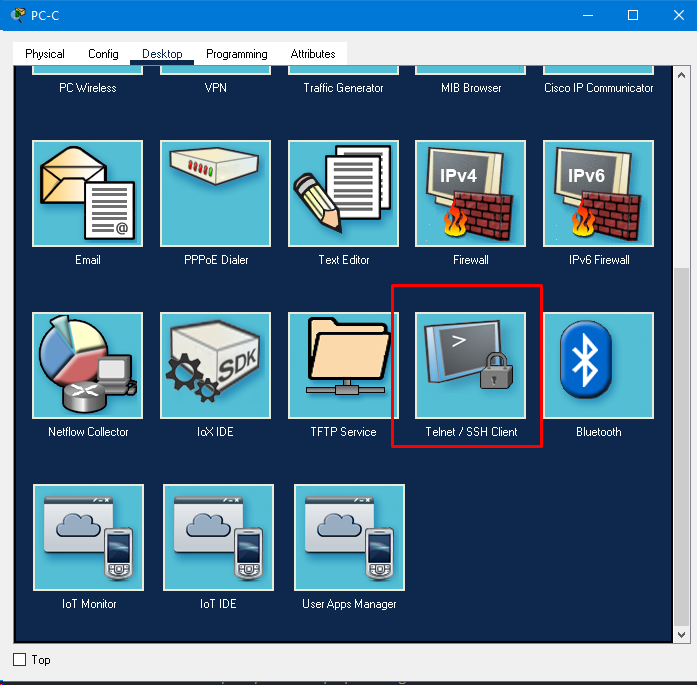
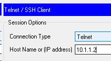
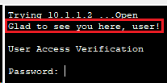
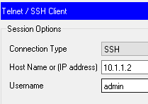
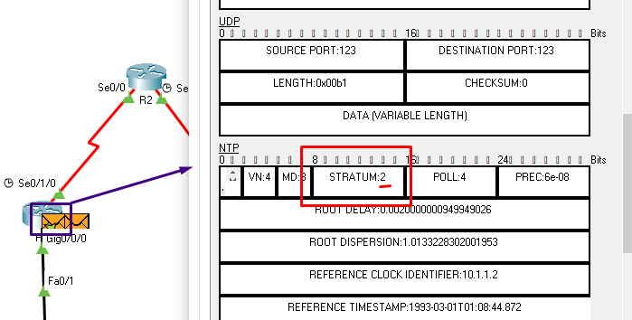
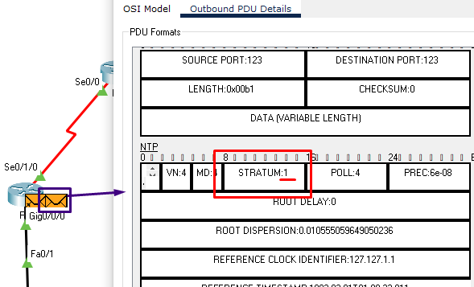

# Laborator 2 la ASRC

A elaborat: **Curmanschii Anton, IA1901.**

Tema: **Securizarea routerului pentru acces administrativ.**


## Partea 1: Configurare de bază a dispozitivului de rețea


**Obiectivele:**

- Cablați rețeaua așa cum se arată în topologie. 
- Configurați adresarea IP de bază pentru routere și computere. 
- Configurați rutarea statică, inclusiv rutele implicite. 
- Verificați conectivitatea între gazde și routere. 

<style>
img[alt^="small"] 
{ 
    width: 400px;
}
</style>


[DTE](https://www.wikiwand.com/en/Data_terminal_equipment),
[DCE](https://www.wikiwand.com/en/Data_circuit-terminating_equipment).

> Avertizarea pentru studenții care utilizează lucrarea mea ca referință!
> Nu utilizați routerele PT-Empty, deoarece versiunea OS-ului pe ele este învechită, și nu suportă funcțiile care se cere să ilustrați în această lucrare de laborator. 
> Utilizați un router cu versiunea OS-ului mai nouă, ca, de exemplu, modelul 4331.

Am început cu routere și switch-uri vide (Empty).
Am adăugat în ele acele module cu acele porturi de care avem nevoie pentru funcționarea corectă a sistemei.

- În R1 și în R3 am pus câte un modul **1CFE** (admite o singură conexiune Ethernet) și câte un modul **1SS** (admite o singură conexiune serială).
- În R2 am pus două module **1SS**.
- În switch-uri am pus câte 5 module **1FCE** (Fast Ethernet).

Am configurat toate dispozitivele. De exemplu, comenzile configurării routerului R3 arată astfel:

```
enable
configure terminal

interface FastEthernet0/0
ip address 192.168.3.1 255.255.255.0
no shutdown
exit

interface Serial1/0
ip address 10.2.2.2 255.255.255.252
no shutdown
exit
```

Configurarea statică a hosturilor PC-A și PC-C:


Putem deja verifica dacă există o conexiune între routere:


<!-- Pinging R2 from R1 -->


```
Router#ping 10.1.1.1

Type escape sequence to abort.
Sending 5, 100-byte ICMP Echos to 10.1.1.1, timeout is 2 seconds:
!!!!!
Success rate is 100 percent (5/5), round-trip min/avg/max = 8/11/15 ms
```


```
Router#ping 10.2.2.1

Type escape sequence to abort.
Sending 5, 100-byte ICMP Echos to 10.2.2.1, timeout is 2 seconds:
!!!!!
Success rate is 100 percent (5/5), round-trip min/avg/max = 7/12/15 ms
```


```
Router>ping 10.1.1.2

Type escape sequence to abort.
Sending 5, 100-byte ICMP Echos to 10.1.1.2, timeout is 2 seconds:
!!!!!
Success rate is 100 percent (5/5), round-trip min/avg/max = 8/12/16 ms

Router>ping 10.2.2.2

Type escape sequence to abort.
Sending 5, 100-byte ICMP Echos to 10.2.2.2, timeout is 2 seconds:
!!!!!
Success rate is 100 percent (5/5), round-trip min/avg/max = 6/12/18 ms
```


<!-- Pinging R3 de la PC-C -->


```
C:\>ping 192.168.3.1

Pinging 192.168.3.1 with 32 bytes of data:

Reply from 192.168.3.1: bytes=32 time<1ms TTL=255
Reply from 192.168.3.1: bytes=32 time<1ms TTL=255
Reply from 192.168.3.1: bytes=32 time<1ms TTL=255
Reply from 192.168.3.1: bytes=32 time<1ms TTL=255

Ping statistics for 192.168.3.1:
    Packets: Sent = 4, Received = 4, Lost = 0 (0% loss),
Approximate round trip times in milli-seconds:
    Minimum = 0ms, Maximum = 0ms, Average = 0ms
```


<!-- Pinging R1 de la PC-A -->


```
C:\>ping 192.168.1.1

Pinging 192.168.1.1 with 32 bytes of data:

Reply from 192.168.1.1: bytes=32 time<1ms TTL=255
Reply from 192.168.1.1: bytes=32 time<1ms TTL=255
Reply from 192.168.1.1: bytes=32 time<1ms TTL=255
Reply from 192.168.1.1: bytes=32 time<1ms TTL=255

Ping statistics for 192.168.1.1:
    Packets: Sent = 4, Received = 4, Lost = 0 (0% loss),
Approximate round trip times in milli-seconds:
    Minimum = 0ms, Maximum = 0ms, Average = 0ms
```

Este clar că la această etapă încă nu putem face ping la celelalte rețele.
Pentru aceasta trebuie să configurăm rutele implicite.

Toate pachetele pe care R1 nu știe unde să le trimită, le vom trimite la R2.
Asemănător facem la R3.

La R1:

```
ip route 0.0.0.0 0.0.0.0 10.1.1.1
```

La R3:

```
ip route 0.0.0.0 0.0.0.0 10.2.2.1
```


La R2, configurăm subrețelele lor R1 și R3:

```
ip route 192.168.1.0 255.255.255.0 10.1.1.2
ip route 192.168.3.0 255.255.255.0 10.2.2.2
```


```
Router>ping 192.168.3.1

Type escape sequence to abort.
Sending 5, 100-byte ICMP Echos to 192.168.3.1, timeout is 2 seconds:
!!!!!
Success rate is 100 percent (5/5), round-trip min/avg/max = 12/20/24 ms

Router>ping 192.168.3.2

Type escape sequence to abort.
Sending 5, 100-byte ICMP Echos to 192.168.3.2, timeout is 2 seconds:
!!!!!
Success rate is 100 percent (5/5), round-trip min/avg/max = 3/12/18 ms
```


```
Router#ping 10.1.1.1

Type escape sequence to abort.
Sending 5, 100-byte ICMP Echos to 10.1.1.1, timeout is 2 seconds:
!!!!!
Success rate is 100 percent (5/5), round-trip min/avg/max = 8/11/13 ms

Router#ping 192.168.1.1

Type escape sequence to abort.
Sending 5, 100-byte ICMP Echos to 192.168.1.1, timeout is 2 seconds:
!!!!!
Success rate is 100 percent (5/5), round-trip min/avg/max = 15/22/27 ms

Router#ping 192.168.1.2

Type escape sequence to abort.
Sending 5, 100-byte ICMP Echos to 192.168.1.2, timeout is 2 seconds:
!!!!!
Success rate is 100 percent (5/5), round-trip min/avg/max = 10/14/22 ms
```


```
C:\>ping 192.168.3.2

Pinging 192.168.3.2 with 32 bytes of data:

Reply from 192.168.3.2: bytes=32 time=25ms TTL=125
Reply from 192.168.3.2: bytes=32 time=14ms TTL=125
Reply from 192.168.3.2: bytes=32 time=13ms TTL=125
Reply from 192.168.3.2: bytes=32 time=2ms TTL=125

Ping statistics for 192.168.3.2:
    Packets: Sent = 4, Received = 4, Lost = 0 (0% loss),
Approximate round trip times in milli-seconds:
    Minimum = 2ms, Maximum = 25ms, Average = 13ms
```


## Partea 2: Control acces administrativ pentru routere

**Obiectivele:**

- Configurați și criptați toate parolele. 
- Configurați un banner de avertizare de conectare. 
- Configurați securitatea îmbunătățită a parolei utilizatorului. 
- Configurați securitatea de conectare virtuală îmbunătățită. 
- Configurați un server SSH pe un router. 
- Configurați un client SSH și verificați conectivitatea. 


[Sintaxa enable password și enable secret](https://pediaa.com/what-is-the-difference-between-enable-password-and-enable-secret/).

[Diferența între enable password și enable secret, best practices](https://community.cisco.com/t5/networking-documents/understanding-the-differences-between-the-cisco-password-secret/ta-p/3163238).

[Comenzile de bază](https://w7cloud.com/packet-tracer-cisco-commands-list-cli-basic/).

[Despre nivelurile de privilegii](https://www.oreilly.com/library/view/hardening-cisco-routers/0596001665/ch04.html#hardcisco-CHP-4-SECT-7).

Deci, sumarizez:

- Se utilizează comanda `enable secret` pentru a pune parola la accesarea unui anumit nivel de privilegii al device-ului. 
  Implicit, routerele nu sunt parolate, adică pot fi accesate fără parolă.
- Există mai multe tipuri de stocare a parolelor, cele mai sigure metode fiind Type 6 care utilizează criptarea simetrică cu AES-128 cu o cheie master, sau Type 8 și Type 9 care folosesc funcții hash criptografice unidirecționale pe mai multe runde.
- `enable password` este o metodă deprecată de setarea parolelor.
- Routeri au 16 niveluri de privilegii cu permisiuni configurabile. 
  Implicit, sunt accesibile doar nivelurile 0, 1 și 15. 
  În Cisco Packet Tracer însă pare că nu putem accesa nivelul 0, deoarece accesul minim este 1.
  Poate fi că dacă punem parola la nivelul 1, îl vom putea accesa implicit.
  Folosim comanda `enable LEVEL_NUMBER` pentru a ne escala nivelul curent de privilegii la nivelul indicat.

Vom face cel mai simplu lucru — vom seta o singură parolă pentru nivelul de privilegii 15 la toate routere.
Este clar că trebuie să indicăm parole puternice într-un sistem real, însă aici ca să nu încurcăm parolele, vom pune parola simplă "1111".


Următoarea comandă setează parola 1111 la nivelul cel mai elevat de privilegii, utilizând metoda implicită de criptare (Type 5, SHA-256). [Documentația](https://www.cisco.com/c/en/us/td/docs/ios-xml/ios/security/d1/sec-d1-cr-book/sec-cr-e1.html#wp3438133060).

```
enable secret level 15 1111
```

Acum ne scoatem privilegiile, după ce ne intoarcem la nivelul privilegiat 15.
```
R1# disable

R1> enable
Password: 1111

R1# show privilege
Current privilege level is 15
```

Unica problema cu setarea tipului de stocare a parolelor (a tipului de criptare) este că trebuie să introducem parola deja criptată, ceea ce nu-i tare comod.
Pentru a seta o parolă cu o metodă de criptare specifică dar trebuie să folosim un program aparte pentru a cripta textul clar, deoarece router-ul nu poate face acest lucru implicit, dintr-o oarecare cauză.
Probabil există o comandă care pur și simplu face criptarea, dar eu nu o pot găsi.

Deci în continuare setăm în modul indicat mai sus parole la toate routerele.

### Configurați un banner de avertizare de conectare.

<!-- [Informații despre Cisco Banner](https://www.manageengine.com/network-configuration-manager/configlets/configure-banner-cisco.html). -->

[Documentația](https://www.cisco.com/en/US/docs/ios/security/command/reference/sec_cr_book.pdf#page=380&zoom=auto,-91,718).

[Despre Telnet](https://www.wikiwand.com/en/Telnet). Telnet este un protocol de comunicare bidirecțională orientată pe text. Este un protocol veșnic, nesecurizat: mesajele sunt transmise în canal public și nu sunt criptate. A fost înlocuit cu [SSH](https://www.wikiwand.com/en/Secure_Shell). SSH criptează toate mesajele, protejând confidențialitatea comunicațiilor și datele sensitive.

Banner - este textul arătat utilizatorului când are loc o conectare la distanță de la host-ul utilizatorului la server.
În cazul nostru, router-ul joacă rolul serverului, iar unul din calculătoare este host.
De obicei pentru acest lucru se folosește protocolul SSH.
Deci înainte de a-l putea vedea pe acest banner setat, vom trebui să configurăm protocolul SSH pe router.

Am accesat informația din [acest document](https://www.cisco.com/c/dam/en/us/td/docs/ios/security/configuration/guide/12_4t/sec_12_4t_book.pdf) care dă instrucțiuni și informații exhaustive referitor la aceste lucruri.
[Ghid pentru implementarea securității cu parolele, login-urile pentru sesiunile CLI](https://www.cisco.com/c/dam/en/us/td/docs/ios/security/configuration/guide/12_4t/sec_12_4t_book.pdf#page=3075&zoom=180,65,616).

Pentru un test rapid vom configura Telnet, deoarece SSH trebuie mai mult setup.
Pentru a configura Telnet pentru sesiuni la distanță, folosesc următoarele comenzi:
```
R1> enable
R1# configure terminal
R1(config)# line vty 0 4
R1(config-line)# password 1111
R1(config-line)# end
```
<!-- [VTY (virtual teletype)](https://ipwithease.com/what-is-meaning-of-line-vty-0-4-in-configuration-of-cisco-router-or-switch/) este portul care permite aplicarea protocoalelor Telnet și SSH. -->

Următorul mesaj va fi arătat la login.

```
R1# configure terminal
R1(config)# banner login &Glad to see you here, user!&
```

Acum ne conectăm la router R1 de pe calculatorul PC-C, folosind Telnet.








### Configurați securitatea îmbunătățită a parolei.

Implicit, toate parolele sunt stocate în text clar (cu excepția parolei `enable secret`).
Un atacator ar putea să le găsească în rundown-ul configurării și să le fure:

```
R1> enable
Password: 1111
R1# show run | include password
no service password-encryption
 password 1111
```

Chiar dacă nu are parola de `enable secret`, poate descărca fișierul de configurație și poate să le găsescă în acel fișier, analizându-l cu un program.

Putem folosi serviciul `service password-encryption` pentru a cripta parolele.
Însă, acest serviciu folosește cifrul slab Vigenere care poate fi spart aproape imediat de un program specializat.
Iată, de exemplu, [cracker-ul oficial](https://www.firewall.cx/cisco-technical-knowledgebase/cisco-routers/358-cisco-type7-password-crack.html) produs de Cisco singuri.

```
R1# configure terminal
R1(config)# service password-encryption
R1(config)# end
```

Acum dacă arătăm `show run`, vedem că parola a fost cifrată cu metoda 7 (Vigenere).

```
R1# show run | include password
service password-encryption
 password 7 08701D1F58
```

<!-- Presupun că putem schimba metoda aceasta în timpul setării acestei parole, dar pare că nu am dreptate.
```
R1#config termina
Enter configuration commands, one per line.  End with CNTL/Z.
R1(config)#line vty 0 4
R1(config-line)#no password
R1(config-line)#password ?
  7     Specifies a HIDDEN password will follow
  LINE  The UNENCRYPTED (cleartext) line password
R1(config-line)#password 1111
R1(config-line)#end
``` -->

### Configurarea parolelor utilizatorilor

Ca să putem proceda cu criptarea parolelor utilizatorilor, trebuie la început să configurăm conturile utilizatorilor.
Vom folosi [următorul ghid](https://www.cisco.com/c/dam/en/us/td/docs/ios/security/configuration/guide/12_4t/sec_12_4t_book.pdf#page=3099&zoom=180,31,425).

Utilizăm comanda `username`. Parola implicit este criptată utilizând algoritmul MD5.

```
R1(config)# username admin privilege 15 secret 1111
R1(config)# end
R1# show run | include secret
enable secret 5 $1$mERr$yZKBoxU.805LdhSXOw6y61
username admin privilege 15 secret 5 $1$mERr$yZKBoxU.805LdhSXOw6y61
```

Dacă se dorește ca parolele să fie criptate utilizând un algoritm diferit decât cel implicit, ele trebuie fi introduse deja criptate individual atunci când se crează parola, pe lângă tipului numeric al criptării.
Iarăși, cum s-a menționat anterior, această metodă nu este comodă, deoarece necesită criptarea aparte, cu toate este clar că poate fi realizată direct în router cu parola clară ca input.
Poate există o metodă, dar eu nu o pot găsi.

Asemănător, putem crea un cont pentru un utilizator de nivelul privilegiat, zicem, 7, dar din punct de vedere al privilegiilor el ar fi la nivelul user, adică nivelul de privilegii 1.
Aceasta înseamnă că ar putea utiliza doar comenzile nivelului 1 (un set foarte mic de comenzi).
Ca să facem acest nivel 7 de privilegii semnificativ, trebuie să mișcăm nivelul necesar pentru executarea unelor comenzi de la nivelul 15 la nivelul 7, ca acel utilizator de nivel 7 să aibă vreun avantaj asupra nivelului 1.
Aceasta o vom face în [partea 3](#partea-3-configurarea-rolurilor-administrative).

> De fapt, nu. Sistemul de control prin niveluri de privilegii a fost de fapt supracedat de lucrul cu vizualizări și roluri.
> În partea 3 se realizează exact acel aspect.

### Configurarea SSH

Ca să putem configura SSH, <!-- avem nevoie de un CA (Certification Authority) care să distribuie certificate digitale, iar pentru crearea certificatelor  --> avem nevoie de o pereche de chei RSA.
Prin urmare, generez o pereche de chei după un modul pe 1024 de biți.

> Pentru securitate, se recomandă să se folosească cheile după modulul pe 1024 de biți, dar atunci și generarea lor va lua mai mult timp.
> Pentru serveri CA se recomandă lungimea de 2048 de biți.  

```
R1# configure terminal
R1(config)# crypto key generate rsa general-keys modulus 1024
% Please define a domain-name first.
```

Deci la început trebuie să setăm numele domenului.
`ip domain name` permite stabilirea partei finale a domeniului organizației.
De exemplu, am specificat `anton.com`.
Înainte ca adresa să fie rezolvată de serverul DNS, dacă nu este qualificată întreg, la ea se adaugă acest șir numelui domeniului.
De exemplu, dacă utilizatorul solicită adresa `servername` în browser, router-ul o va mapa la `servername.anton.com`, după ce va face interogarea DNS. [Informații](https://community.cisco.com/t5/other-network-architecture/ip-domain-list/td-p/614646).

> Există versiunea acestei comenzi care permite generarea cheilor SSH numite, folosind opțiunea label.
> Însă această funcționalitate [a fost adăugată în versiunea 12.2(8)T](https://www.cisco.com/c/en/us/td/docs/ios-xml/ios/security/a1/sec-a1-xe-3se-3850-cr-book/sec-a1-xe-3se-3850-cr-book_chapter_0110.pdf#page=3&zoom=auto,-91,545), pe când în Cisco packet tracer avem versiunea 12.2.
> De aceea, pentru a genera o pereche de chei RSA, totuși trebuie să configurăm `ip domain name`.

```
R1(config)# ip domain name anton.com
```

În cazul nostru însă nu avem nici un server DNS, nici local, nici un server global de pe Internet, deci putem stinge opțiunea de DNS lookup pe router (comanda `no ip domain lookup`).
<!-- Încă am putea scoate opțiunea `ip domain name` după ce am generat o pereche de chei și am renumit-o. -->

```
R1(config)# no ip domain lookup
R1(config)# crypto key generate rsa general-keys modulus 1024 
The name for the keys will be: R1.anton.com

% The key modulus size is 1024 bits
% Generating 1024 bit RSA keys, keys will be non-exportable...[OK]
*Mar 1 1:38:49.122: %SSH-5-ENABLED: SSH 1.99 has been enabled
```

SSH 1.99 înseamnă că routerul suportă și SSH v1, și SSH v2. [Sursa](https://community.cisco.com/t5/switching/ssh-v1-99-vs-v2-0/td-p/1901112).

Acum putem arăta cheia în modul exec.

```
R1# show crypto key mypubkey rsa 
% Key pair was generated at: 1:38:49 UTC March 1 1993
Key name: R1.anton.com
 Storage Device: not specified
 Usage: General Purpose Key
 Key is not exportable.
 Key Data:
 00001615  00006aed  00005c7f  00000aa8  00003e01  0000572b  00006bfd  00005ec8
 00003c0d  00006700  000032d4  00006a7c  00002e89  00002c08  00007685  00002e4f
 0000609f  00001e57  00000222  00006f1a  00005194  000016b0  000007b3  21d9
% Key pair was generated at: 1:38:49 UTC March 1 1993
Key name: R1.anton.com.server
Temporary key
 Usage: Encryption Key
 Key is not exportable.
 Key Data:
 0000414b  000038f7  000030d7  000049b7  0000660b  000062e9  000022af  00007c6b
 00002f81  0000730b  000078f7  000000c7  00003b09  00007be0  00007c76  00003b8e
 00005d29  0000375f  00001899  00005e87  0000645e  00004ea4  0000545b  0dcf
```

Din documentația despre comanda:
> Secure Shell (SSH) may generate an additional RSA key pair if you generate a key pair on a router having no RSA keys. 
> The additional key pair is used only by SSH and will have a name such as {router_FQDN}.server. 
> For example, if a router name is "router1.cisco.com", the key name is "router1.cisco.com.server".


Deci, crearea unei pereche de chei criptografice activează automat și SSH.

```
R1# show ip ssh
SSH Enabled - version 1.99
Authentication timeout: 120 secs; Authentication retries: 3

R1# show ssh
%No SSHv2 server connections running.
%No SSHv1 server connections running.
```


La conectare lucrează orice login.



Router-ul cere parola setată la linia vty 0-4; router-ul nu arată banner-ul de logare.

```
Password: 1111
R1>
```

## Partea 3: Configurarea rolurilor administrative 

**Obiectivele:**

- Creați vizualizări de roluri multiple și acordați privilegii diferite. 
- Verificați și contrastați opiniile. 


<!-- ### Crearea unor vizualizări de roluri -->

Am utilizat anterior routere PT-Empty.
Însă, versiunea OS-ului pe acele routere este învechită, și nu permite configurarea vizualizărilor.
Din fericire, routerul de modelul 4331 are versiunea OS-ului 16.7(3r), pe când vizualizările au fost adăugate în versiunea 12.3.
Am substituit router-ul R1 veche cu cel nou și am reintrodus comenzile necesare de configurare.

> Am încercat și să copiez imaginea configurației de la dispozitivul veche la dispozitivul nou, însă OS-ul pe R1 era atât de veche că nici nu suporta comanda `tftp-server` necesară pentru [copierea configurației](https://www.cisco.com/c/en/us/support/docs/routers/2500-series-routers/15092-copyimage.html).
> Copierea configurației utilizând interfața în Cisco Packet Tracer tot nu a lucrat, nici nu a dat greșeli.
> Presupun că această funcționalitate nu lucrează pentru dispozitive cu versiunele OS-ului diferite.

Deci înainte de a putea [configura vizualizările](https://www.cisco.com/en/US/docs/ios/12_3t/12_3t7/feature/guide/gtclivws.html), trebuie să activăm AAA. [Mai multe informații despre AAA](https://www.cisco.com/c/dam/en/us/td/docs/ios/security/configuration/guide/12_4t/sec_12_4t_book.pdf#page=2301&zoom=180,41,640).

```
R1(config)# aaa new-model
```

Acum începem cu configurarea vizualizărilor. În primul rând, trebuie să ne schimbăm vizualizarea la ceea care corespunde la nivelul de privilegii 15, root view:

```
R1# enable view
Password: 
R1#%PARSER-6-VIEW_SWITCH: successfully set to view 'root'.
```

Următorii pași crează o vizualizare:

```
R1# configure terminal
R1(config)# parser view ping-reload-view
R1(config-view)#%PARSER-6-VIEW_CREATED: view 'ping-reload-view' successfully created.

R1(config-view)# secret 0 2222
R1(config-view)# commands exec include all ping
R1(config-view)# commands exec include all reload
R1(config-view)# end
R1# copy running-config startup-config
```

Verificăm:
```
R1# enable view ping-reload-view
Password: 2222
R1#%PARSER-6-VIEW_SWITCH: successfully set to view 'ping-reload-view'.

R1# ping 10.1.1.1

Type escape sequence to abort.
Sending 5, 100-byte ICMP Echos to 10.1.1.1, timeout is 2 seconds:
!!!!!
Success rate is 100 percent (5/5), round-trip min/avg/max = 8/11/13 ms

R1#?
Exec commands:
  disable     Turn off privileged commands
  enable      Turn on privileged commands
  exit        Exit from the EXEC
  logout      Exit from the EXEC
  ping        Send echo messages
  reload      Halt and perform a cold restart
```

Parola acestei vizualizări a fost și criptată corespunzător (ultima linie corespunde parolei 2222):
```
R1# enable view
Password: 1111
R1#%PARSER-6-VIEW_SWITCH: successfully set to view 'root'.

R1# show run | include secret
enable secret 5 $1$mERr$yZKBoxU.805LdhSXOw6y61
username admin privilege 15 secret 5 $1$mERr$yZKBoxU.805LdhSXOw6y61
 secret 5 $1$mERr$YuP0cmcgR3EKCCAur54.f0
```

Încă un exemplu. Se configurează o vizualizare ce permite utilizarea comenzii `show ip SUBCOMANDA`:
```
R1# config terminal
R1(config)# parser view show-ip-view
R1(config-view)#%PARSER-6-VIEW_CREATED: view 'show-ip-view' successfully created.

R1(config-view)# secret 0 3333
R1(config-view)# commands exec include all show ip
R1(config-view)# end
R1#
%SYS-5-CONFIG_I: Configured from console by console

R1# enable view show-ip-view
Password: 
R1#%PARSER-6-VIEW_SWITCH: successfully set to view 'show-ip-view'.

R1# show ?
  ip                 IP information
R1# show ip ?
  access-lists  List access lists
  arp           IP ARP table
  bgp           BGP information
  cache         IP fast-switching route cache
  cef           Cisco Express Forwarding
  dhcp          Show items in the DHCP database
  eigrp         IP-EIGRP show commands
  interface     IP interface status and configuration
  nat           IP NAT information
  nbar          Network-Based Application Recognition
  ospf          OSPF information
  protocols     IP routing protocol process parameters and statistics
  rip           IP RIP show commands
  route         IP routing table
  ssh           Information on SSH
```


> Routerul nu suportă posibilitatea de a asocia vizualizări cu utilizatorii.
> Am găndit că deoarece "train"-ul (16.7) este mai mare decât celul în care a fost adăugată această posibilitate (12.2SRB),
> această versiune va conține toate capacitățile versiunii 12.2(33)SRB, dar nu am avut dreptate.
> Ei au [modul lor special de a prescrie versiuni la build-uri](https://www.cisco.com/c/en/us/support/docs/ios-nx-os-software/ios-software-release-1513t/200095-Understanding-Cisco-IOS-Naming-Conventio.html).
> Nu este atât de ușor de determinat dacă o versiune specifică are anumite capacități.


<!-- What is "Verificați și contrastați opiniile." ???? -->

<!-- 
Even the max IOS version does not have these! a shame!

### Crearea unor supravizualizări de roluri

O supravizualizare înseamnă de fapt o grupă de mai multe vizualizări combinate.
Deci o supravizualizare permite utilizarea tuturor comenzilor admisibile pentru acele vizualizări pe care le conține. -->


## Partea 4: Configurarea raportărilor de reziliență și management Cisco IOS

**Obiectivele:**

- Asigurați fișierele de imagine și configurare Cisco IOS. 
- Configurați un router ca sursă de timp sincronizată pentru alte dispozitive care utilizează NTP. 
- Configurați suportul Syslog pe un router. 
- Instalați un server Syslog pe un computer și activați-l. 
- Configurați raportarea capcanelor pe un router folosind SNMP.
- Efectuați modificări ale routerului și monitorizați rezultatele syslog-ului pe computer. 


### Sincronizarea ceasului utilizând NTP

Aici nu descriu ce-i NTP. [Sursa utilizată pentru studierea mai multor informații și comenzi folosite](https://www.cisco.com/c/en/us/td/docs/ios-xml/ios/bsm/configuration/12-4t/bsm-12-4t-book/bsm-time-calendar-set.html).

> Comanda `ntp peer` lipsește pe versiunea Cisco IOS din Cisco Packet Tracer.

Vom face routerul R1 să funcționeze ca un server NTP master.
Aceasta înseamnă că R1 va distribui pachetele NTP de sincronizare a timpului în dependența de ceasul hardware al său.
Setarea unui server ca master se folosește pentru a simula apartenența stratului 1 în ierarhia NTP (este în fața ceasului de referință, al stratului 0).

```
R1> enable
Password: 1111
R1# config terminal
Enter configuration commands, one per line.  End with CNTL/Z.
R1(config)# ntp master ?
  <1-15>  Act as NTP master clock
  <cr>
R1(config)# ntp master 1
R1(config)# end
```

Acum routerul R1 va răspunde la solicitări de sincronizare din partea clienților.

Routerul R2 îl vom configura ca un server de modul simetric activ, adică va funcționa și ca un client, și ca un server NTP.
Va lua timpul de la routerul R1, și va funcționa ca un provizor NTP de strat 2.
`ntp update-calendar`, după cum am înțeles, face ca ceasul intern al dispozitivului să fie ajustat în raport cu timpul primit de la NTP. 
```
R2> enable
Password: 1111
R2# config terminal
Enter configuration commands, one per line.  End with CNTL/Z.
R2(config)# ntp server 10.1.1.2
R2(config)# ntp update-calendar
R2(config)# end
```

[Video cu demonstrarea comunicării între R1 și R2](https://youtu.be/hLeurk-YD4s). Filtrarea tipurilor de pachete este setată la UDP — protocolul utilizat sub capota pentru funcționarea NTP.

Routerul R3 va fi la fel dependent de R2, și va funcționa și el în modul simetric.
```
R3> enable
Password: 1111
R3# config terminal
Enter configuration commands, one per line.  End with CNTL/Z.
R3(config)# ntp server 10.2.2.1
R3(config)# ntp update-calendar
R3(config)# end
```

Routerii determină singuri la ce strat ei aparțină. Putem inspecta pachet-ul de solicitare trimis de R2, de exemplu.



Iar răspunsul vine deja din partea R1 care i-am atribuit stratul 1, deci pachetul transmis drep răspuns deja conține strat egal cu 1.




Nu știu cum să verific dacă computer-ul, zicem, PC-A, poate accesa serviciul de timp NTP al routerului R3.
În principiu, trebuie să creez un mesaj UDP formatat conform standardului NTP și să-l transmit la portul 123, dar nu știu ce să utilizez pentru a face aceasta în Packet Tracer.


### Setarea serviciului Syslog

[Informații despre Syslog](https://www.cisco.com/c/en/us/td/docs/routers/access/wireless/software/guide/SysMsgLogging.html).


## Partea 5: Configurarea funcțiilor de securitate automatizate 

**Obiectivele:**

- Blocați un router utilizând AutoSecure și verificați configurația. 
- Folosiți instrumentul Audit de securitate SDM pentru a identifica vulnerabilitățile și pentru a bloca serviciile. 
- Contrastați configurația AutoSecure cu SDM.
