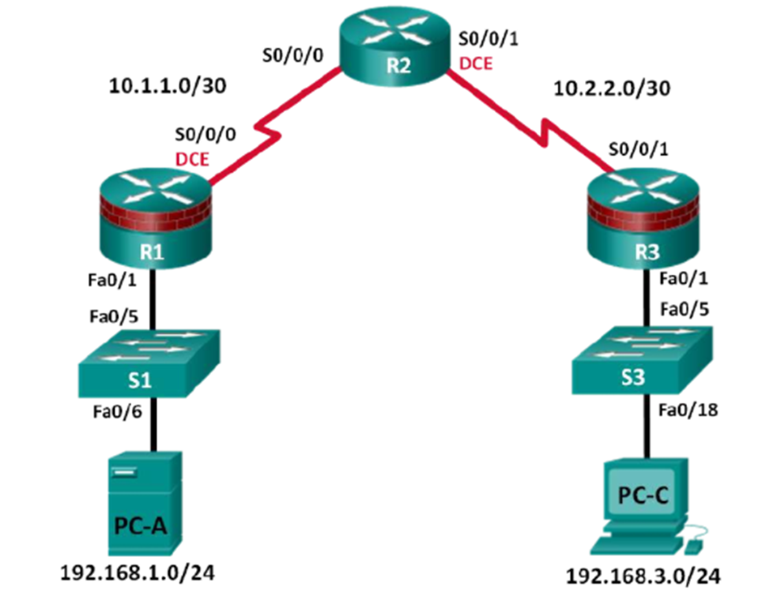
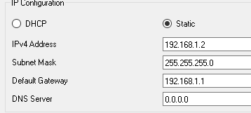
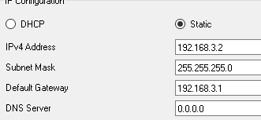
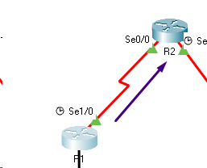
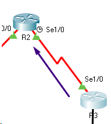
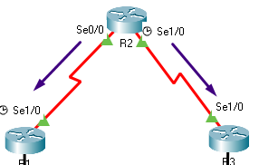
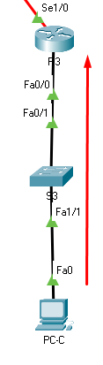
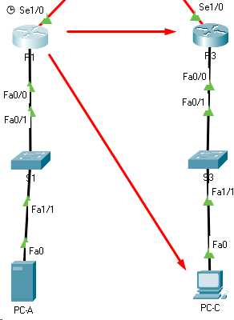
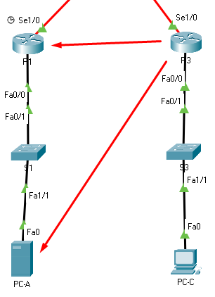
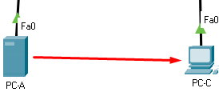

# Laborator 2 la ASRC

A elaborat: **Curmanschii Anton, IA1901.**

Tema: **Securizarea routerului pentru acces administrativ.**


## Obiectivele


## Partea 1: Configurare de bază a dispozitivului de rețea


**Obiectivele:**

- Cablați rețeaua așa cum se arată în topologie. 
- Configurați adresarea IP de bază pentru routere și computere. 
- Configurați rutarea statică, inclusiv rutele implicite. 
- Verificați conectivitatea între gazde și routere. 

<style>
img[alt^="small"] 
{ 
    width: 400px;
}
</style>



[DTE](https://www.wikiwand.com/en/Data_terminal_equipment),
[DCE](https://www.wikiwand.com/en/Data_circuit-terminating_equipment).


Am început cu routere și switch-uri vide (Empty).
Am adăugat la ele acele porturi de care avem nevoie pentru funcționarea corectă a sistemei.

- În R1 și în R3 am pus câte un modul **1CFE** (admite o singură conexiune Ethernet) și câte un modul **1SS** (admite o singură conexiune serială).
- În R2 am pus două module **1SS**.
- În switch-uri am pus câte 5 module **1FCE** (Fast Ethernet).

Am configurat toate dispozitivele. De exemplu, comenzile configurării routerului R3 arată astfel:

```
enable
configure terminal

interface FastEthernet0/0
ip address 192.168.3.1 255.255.255.0
no shutdown
exit

interface Serial1/0
ip address 10.2.2.2 255.255.255.252
no shutdown
exit
```

Configurarea statică a hosturilor PC-A și PC-C:





Putem deja verifica dacă există o conexiune între routere:


<!-- Pinging R2 from R1 -->



```
Router#ping 10.1.1.1

Type escape sequence to abort.
Sending 5, 100-byte ICMP Echos to 10.1.1.1, timeout is 2 seconds:
!!!!!
Success rate is 100 percent (5/5), round-trip min/avg/max = 8/11/15 ms
```




```
Router#ping 10.2.2.1

Type escape sequence to abort.
Sending 5, 100-byte ICMP Echos to 10.2.2.1, timeout is 2 seconds:
!!!!!
Success rate is 100 percent (5/5), round-trip min/avg/max = 7/12/15 ms
```




```
Router>ping 10.1.1.2

Type escape sequence to abort.
Sending 5, 100-byte ICMP Echos to 10.1.1.2, timeout is 2 seconds:
!!!!!
Success rate is 100 percent (5/5), round-trip min/avg/max = 8/12/16 ms

Router>ping 10.2.2.2

Type escape sequence to abort.
Sending 5, 100-byte ICMP Echos to 10.2.2.2, timeout is 2 seconds:
!!!!!
Success rate is 100 percent (5/5), round-trip min/avg/max = 6/12/18 ms
```


<!-- Pinging R3 de la PC-C -->



```
C:\>ping 192.168.3.1

Pinging 192.168.3.1 with 32 bytes of data:

Reply from 192.168.3.1: bytes=32 time<1ms TTL=255
Reply from 192.168.3.1: bytes=32 time<1ms TTL=255
Reply from 192.168.3.1: bytes=32 time<1ms TTL=255
Reply from 192.168.3.1: bytes=32 time<1ms TTL=255

Ping statistics for 192.168.3.1:
    Packets: Sent = 4, Received = 4, Lost = 0 (0% loss),
Approximate round trip times in milli-seconds:
    Minimum = 0ms, Maximum = 0ms, Average = 0ms
```


<!-- Pinging R1 de la PC-A -->


```
C:\>ping 192.168.1.1

Pinging 192.168.1.1 with 32 bytes of data:

Reply from 192.168.1.1: bytes=32 time<1ms TTL=255
Reply from 192.168.1.1: bytes=32 time<1ms TTL=255
Reply from 192.168.1.1: bytes=32 time<1ms TTL=255
Reply from 192.168.1.1: bytes=32 time<1ms TTL=255

Ping statistics for 192.168.1.1:
    Packets: Sent = 4, Received = 4, Lost = 0 (0% loss),
Approximate round trip times in milli-seconds:
    Minimum = 0ms, Maximum = 0ms, Average = 0ms
```

Este clar că la această etapă încă nu putem face ping la celelalte rețele.
Pentru aceasta trebuie să configurăm rutele implicite.

Toate pachetele pe care R1 nu știe unde să le trimită, le vom trimite la R2.
Asemănător facem la R3.

La R1:

```
ip route 0.0.0.0 0.0.0.0 10.1.1.1
```

La R3:

```
ip route 0.0.0.0 0.0.0.0 10.2.2.1
```


La R2, configurăm subrețelele lor R1 și R3:

```
ip route 192.168.1.0 255.255.255.0 10.1.1.2
ip route 192.168.3.0 255.255.255.0 10.2.2.2
```




```
Router>ping 192.168.3.1

Type escape sequence to abort.
Sending 5, 100-byte ICMP Echos to 192.168.3.1, timeout is 2 seconds:
!!!!!
Success rate is 100 percent (5/5), round-trip min/avg/max = 12/20/24 ms

Router>ping 192.168.3.2

Type escape sequence to abort.
Sending 5, 100-byte ICMP Echos to 192.168.3.2, timeout is 2 seconds:
!!!!!
Success rate is 100 percent (5/5), round-trip min/avg/max = 3/12/18 ms
```




```
Router#ping 10.1.1.1

Type escape sequence to abort.
Sending 5, 100-byte ICMP Echos to 10.1.1.1, timeout is 2 seconds:
!!!!!
Success rate is 100 percent (5/5), round-trip min/avg/max = 8/11/13 ms

Router#ping 192.168.1.1

Type escape sequence to abort.
Sending 5, 100-byte ICMP Echos to 192.168.1.1, timeout is 2 seconds:
!!!!!
Success rate is 100 percent (5/5), round-trip min/avg/max = 15/22/27 ms

Router#ping 192.168.1.2

Type escape sequence to abort.
Sending 5, 100-byte ICMP Echos to 192.168.1.2, timeout is 2 seconds:
!!!!!
Success rate is 100 percent (5/5), round-trip min/avg/max = 10/14/22 ms
```




```
C:\>ping 192.168.3.2

Pinging 192.168.3.2 with 32 bytes of data:

Reply from 192.168.3.2: bytes=32 time=25ms TTL=125
Reply from 192.168.3.2: bytes=32 time=14ms TTL=125
Reply from 192.168.3.2: bytes=32 time=13ms TTL=125
Reply from 192.168.3.2: bytes=32 time=2ms TTL=125

Ping statistics for 192.168.3.2:
    Packets: Sent = 4, Received = 4, Lost = 0 (0% loss),
Approximate round trip times in milli-seconds:
    Minimum = 2ms, Maximum = 25ms, Average = 13ms
```


## Partea 2: Control acces administrativ pentru routere

**Obiectivele:**

- Configurați și criptați toate parolele. 
- Configurați un banner de avertizare de conectare. 
- Configurați securitatea îmbunătățită a parolei utilizatorului. 
- Configurați securitatea de conectare virtuală îmbunătățită. 
- Configurați un server SSH pe un router. 
- Configurați un client SSH și verificați conectivitatea. 


## Partea 3: Configurarea rolurilor administrative 

**Obiectivele:**

- Creați vizualizări de roluri multiple și acordați privilegii diferite. 
- Verificați și contrastați opiniile. 


## Partea 4: Configurarea raportărilor de reziliență și management Cisco IOS

**Obiectivele:**

- Asigurați fișierele de imagine și configurare Cisco IOS. 
- Configurați un router ca sursă de timp sincronizată pentru alte dispozitive care utilizează NTP. 
- Configurați suportul Syslog pe un router. 
- Instalați un server Syslog pe un computer și activați-l. 
- Configurați raportarea capcanelor pe un router folosind SNMP.
- Efectuați modificări ale routerului și monitorizați rezultatele syslog-ului pe computer. 


## Partea 5: Configurarea funcțiilor de securitate automatizate 

**Obiectivele:**

- Blocați un router utilizând AutoSecure și verificați configurația. 
- Folosiți instrumentul Audit de securitate SDM pentru a identifica vulnerabilitățile și pentru a bloca serviciile. 
- Contrastați configurația AutoSecure cu SDM.
