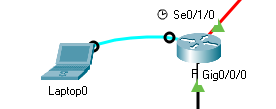

# Laborator 3 la ASRC

A elaborat: **Curmanschii Anton, IA1901.**

Tema: **Asigurarea accesului administrativ folosind AAA și RADIUS.**

Toate configurațiile rețelei în Cisco Packet Tracer [le descărcați de pe github](https://github.com/AntonC9018/uni_asrc/tree/master/lab3/networks).


## Tabelul de conținut

- [Laborator 3 la ASRC](#laborator-3-la-asrc)
  - [Tabelul de conținut](#tabelul-de-conținut)
  - [Partea 1: Configurare de bază a dispozitivului de rețea](#partea-1-configurare-de-bază-a-dispozitivului-de-rețea)
  - [Partea 2: Configurați autentificarea locală](#partea-2-configurați-autentificarea-locală)
  - [Partea 3: Configurarea autentificării locale folosind AAA](#partea-3-configurarea-autentificării-locale-folosind-aaa)
  - [Partea 4: Configurarea autentificării centralizate folosind AAA și RADIUS](#partea-4-configurarea-autentificării-centralizate-folosind-aaa-și-radius)


## Partea 1: Configurare de bază a dispozitivului de rețea

**Obiectivele:**

- Configurați setările de bază, cum ar fi numele gazdei, adresele IP ale interfeței și parolele de acces. 
- Configurați rutarea statică.

Vom folosi aceleași configurații ca și în laboratorul 1.
Vom începe cu configurația în sfârșitul pasului 4 ([fișierul](https://github.com/AntonC9018/uni_asrc/tree/master/lab2/networks/part4.pkt)).


## Partea 2: Configurați autentificarea locală

**Obiectivele:**

- Configurați un utilizator de bază de date locală și acces local pentru liniile console, vty și aux. 
- Testați configurația.

[Informații](https://www.cisco.com/c/dam/en/us/td/docs/ios/security/configuration/guide/12_4t/sec_12_4t_book.pdf#page=52&zoom=180,49,21).


Deja am realizat primul pas de configurare a AAA pe R1:
```
R1# show run | include aaa
aaa new-model
```

AAA permite să definim o listă de metode de autentificare, fiecare din care va fi încercată una după alta.
Prima care nu eșuează (de ex. serverul RADIUS de autentificaer a fost atins) determină rezultatul autentificării (utilizatorul ori se admite, ori se respinge).
Pentru acest exemplu trebuie să configurăm autentificarea din baza de date locală:

```
R1(config)# aaa authentication login all-line-login local

R1(config)# line aux 0
R1(config-line)# login authentication all-line-login
R1(config-line)# exit

R1(config)# line vty 0 4
R1(config-line)# login authentication all-line-login
R1(config-line)# exit

R1(config)# line console 0
R1(config-line)# login authentication all-line-login
R1(config-line)# exit

R1(config-line)# end
```

Deja am creat 2 utilizatori în baza de date locală:

```
R1# show running-config | include username
username admin privilege 15 secret 5 $1$mERr$yZKBoxU.805LdhSXOw6y61
username user1 secret 5 $1$mERr$yZKBoxU.805LdhSXOw6y61
```

Verificăm conexiunea, conectându-ne la router de pe unul dintre calculatoare.

<style>
img[alt^="small"] { width: 400px; }
</style>




Dar sistemul deja ne consideră ca un utilizator logat, deoarece deja am introdus parola anterior.
Interfața lui Cisco Packet Tracer permite interacțiunea cu router-ul printr-o conexiune creată virtual.
Ca totuși să verificăm autentificarea, deja la vty, ne conectăm prin cablul normal.

Conectăm laptopul nou la switch, și îi configurăm adresa la 192.168.1.3.
După aceasta folosim Telnet ori SSH pentru a ne conecta la router.
Ambii folosesc liniile vty.


Cu un utilizator neexistent:


Telnet:


Portul aux folosește tehnologii învechite, se aplică la transmiterea datelor printr-un cablu serial și pentru conexiuni la internet dial-in (de pe telefon).
Cel puțin în Cisco Packet Tracer putem conecta laptop-ul nostru la port-ul Aux al router-ului, dar lucrează tot așa ca dacă l-am fi conectat la portul Console.
Unica diferența este că consola arată mesajul "R1 tty1 is now available" dacă folosim Aux, și "R1 con0 is now available", dacă folosim Console.


## Partea 3: Configurarea autentificării locale folosind AAA

**Obiectivele:**

- Configurați baza de date locală a utilizatorilor utilizând Cisco IOS. 
- Configurați autentificarea locală AAA folosind Cisco IOS. 
- Configurați autentificarea locală AAA folosind SDM. 
- Testați configurația.


Aceste obiective au fost realizate în punctul 1, sau și mai anterior (am umplut baza de date folosind comanda `username`).
Încă, nu putem folosi SDM în Packet Tracer. Cel puțin eu nu am putut găsi cum.

## Partea 4: Configurarea autentificării centralizate folosind AAA și RADIUS

**Obiectivele:**

• Instalați un server RADIUS pe un computer. 
• Configurați utilizatorii pe serverul RADIUS. 
• Configurați serviciile AAA pe un router pentru a accesa serverul RADIUS pentru autentificare cu Cisco IOS. 
• Configurați serviciile AAA pe un router pentru a accesa serverul RADIUS pentru autentificare cu SDM. 
• Testați configurația AAA RADIUS.

